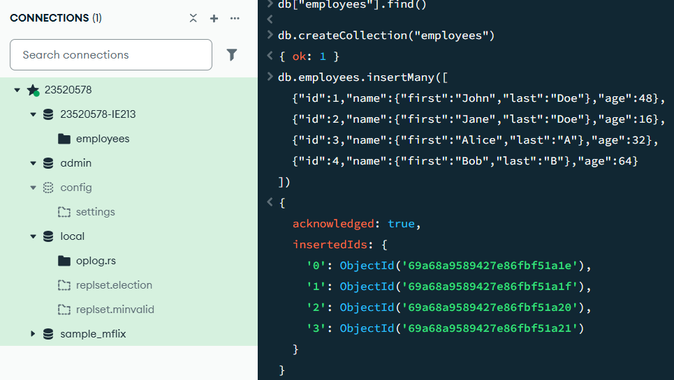
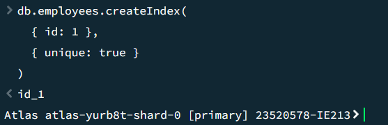
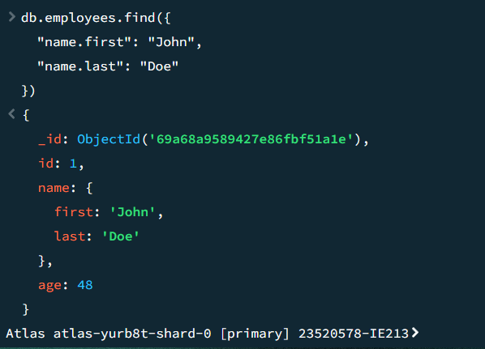
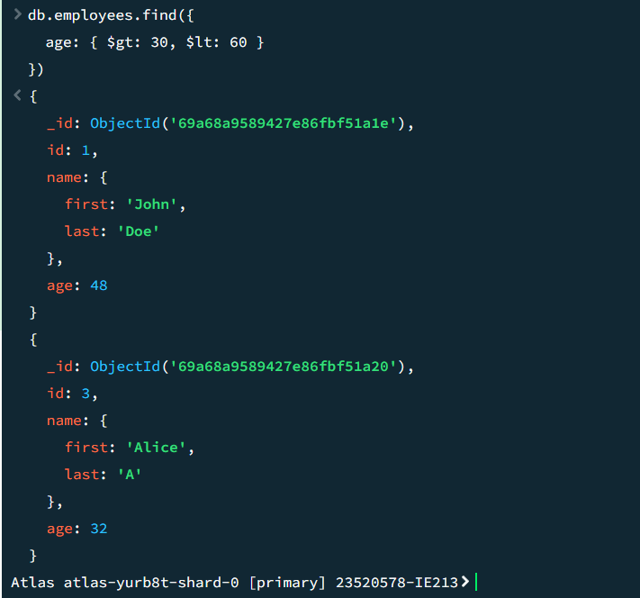
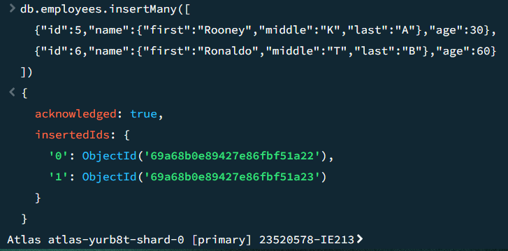
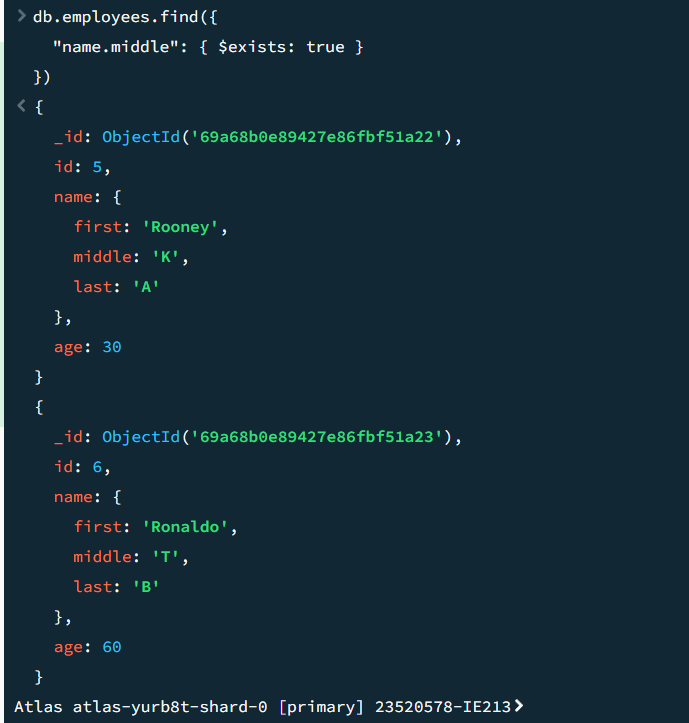
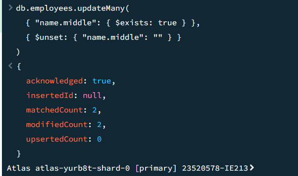
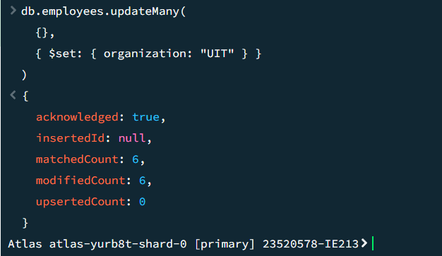
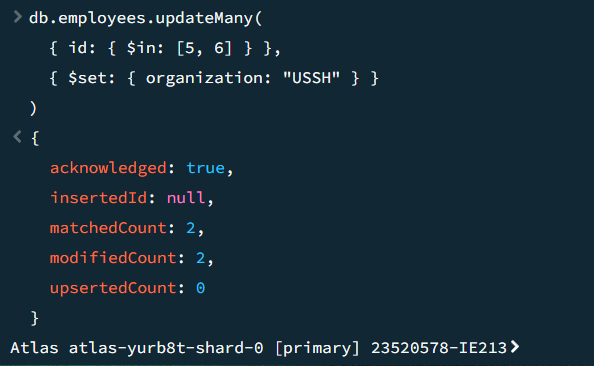
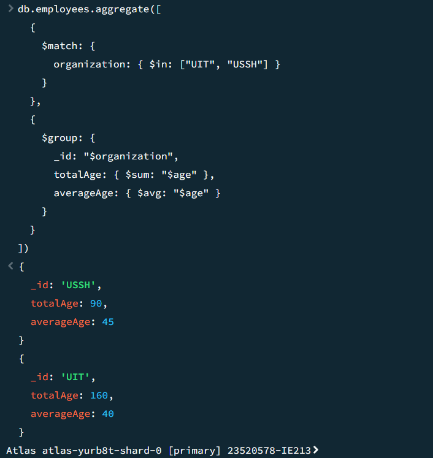

Sinh viên: Trần Nguyễn Ngọc Hùng  
MSSV: 23520578  
Lớp: IE213.Q21.1    
Môn học: IE213.Q21  
Công cụ: MongoSH    

Câu 2.1:    
Lệnh:    
use 23520578-IE213

Câu 2.2:    
Lệnh:   
db.employees.insertMany([
  {"id":1,"name":{"first":"John","last":"Doe"},"age":48},
  {"id":2,"name":{"first":"Jane","last":"Doe"},"age":16},
  {"id":3,"name":{"first":"Alice","last":"A"},"age":32},
  {"id":4,"name":{"first":"Bob","last":"B"},"age":64}
])

Câu 2.3:   
Lệnh:   
db.employees.createIndex(
  { id: 1 },
  { unique: true }
)

Câu 2.4:    
Lệnh: 
db.employees.find({
  "name.first": "John",
  "name.last": "Doe"
})

Câu 2.5:    
Lệnh:   
db.employees.find({
  age: { $gt: 30, $lt: 60 }
})

Câu 2.6:    
Lệnh:   
db.employees.insertMany([
  {"id":5,"name":{"first":"Rooney","middle":"K","last":"A"},"age":30},
  {"id":6,"name":{"first":"Ronaldo","middle":"T","last":"B"},"age":60}
])

Câu 2.7:    
Lệnh:   
db.employees.find({
  "name.middle": { $exists: true }
})

Câu 2.8:    
Lệnh:   
db.employees.updateMany(
  { "name.middle": { $exists: true } },
  { $unset: { "name.middle": "" } }
)

Câu 2.9:    
Lệnh:   
db.employees.updateMany(
  {},
  { $set: { organization: "UIT" } }
)

Câu 2.10:   
Lệnh:   
db.employees.updateMany(
  { id: { $in: [5, 6] } },
  { $set: { organization: "USSH" } }
)

Câu 2.11:   
Lệnh:   
db.employees.aggregate([
  {
    $match: {
      organization: { $in: ["UIT", "USSH"] }
    }
  },
  {
    $group: {
      _id: "$organization",
      totalAge: { $sum: "$age" },
      averageAge: { $avg: "$age" }
    }
  }
])  

